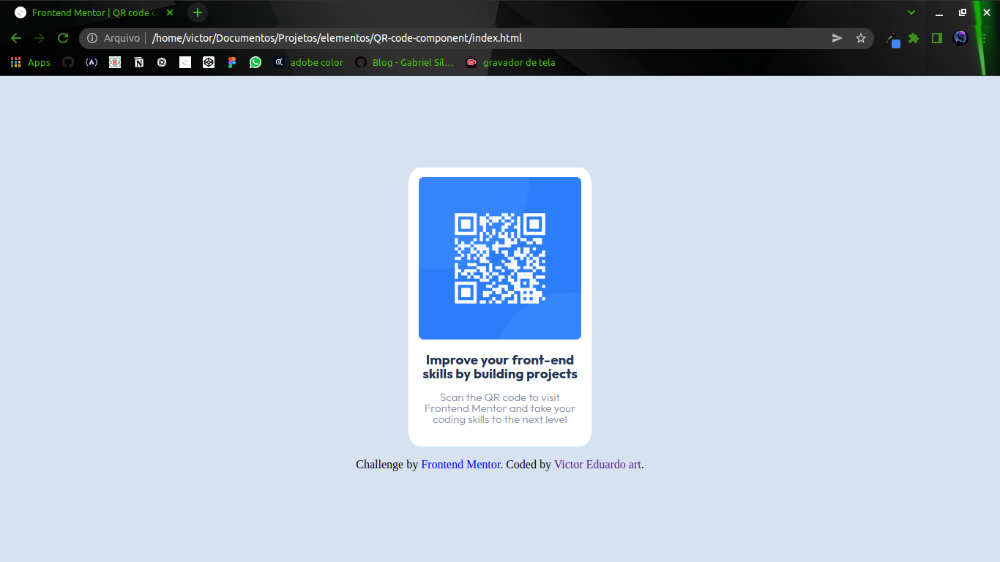

# Frontend Mentor - QR code component solution

This is a solution to the [QR code component challenge on Frontend Mentor](https://www.frontendmentor.io/challenges/qr-code-component-iux_sIO_H). Frontend Mentor challenges help you improve your coding skills by building realistic projects. 

## Table of contents

- [Overview](#overview)
  - [Screenshot](#screenshot)
  - [Links](#links)
- [My process](#my-process)
  - [Built with](#built-with)
  - [What I learned](#what-i-learned)
  - [Continued development](#continued-development)
  - [Useful resources](#useful-resources)
- [Author](#author)

## Overview

### Screenshot



### Links

- Solution URL: [Click here](https://www.frontendmentor.io/solutions/html5-css3-flexbox-3fEH_fodq)
- Live Site URL: [Click here](https://victor-eduardo-art.github.io/QR-code-component/)

## My process

### Built with

- HTML5
- CSS
- Flexbox

### What I learned

i relearned how to reinforce an element vertically with flexbox, in addition to my knowledge of flexbox.

```css
body {
   height: 100vh;
   display: flex;
   flex-direction: column;
   align-items: center;
   justify-content: center;
}
```

### Continued development

I want to get better at the semantics of HTML5 as well as practice more flexbox.

for example:

```html

<div class="main">
    <h3>Improve your front-end skills by building projects</h3>
</div>

```

in this part I was in doubt about which title tag I should use, thinking of a real page I decided to use the <h3>


### Useful resources

- [stackoverflow](https://pt.stackoverflow.com/questions/2817/qual-a-melhor-forma-de-centralizar-um-elemento-vertical-e-horizontalmente) - where I relearned and learned new ways to vertically align an element 

## Author

- Github - [@Victor-Eduardo-art](https://github.com/Victor-Eduardo-art)
- Frontend Mentor - [@@Victor-Eduardo-art](https://www.frontendmentor.io/profile/Victor-Eduardo-art)

